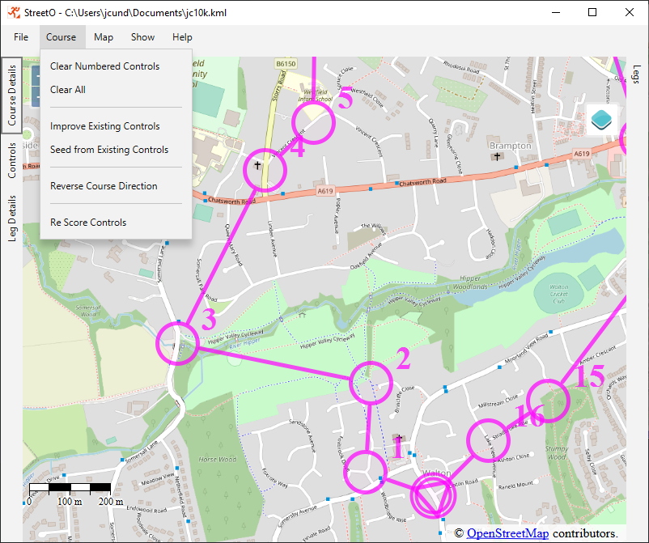

[back](./UserGuide.md)

## Generating Courses

Most functions related to generating or editing courses are found on the Course Menu. These options are discussed
below.

### Clear Numbered Controls

This removes everything apart from the Start and the Finish from the Map and the Course.

### Clear All

This removes everything from the Map and the Course, including the Start and the Finish

### Improve Existing Controls

This will take the controls currently on the map and the current desired course length and feed this information back
into the course generation algorithm.

It will try and find better control sites taking the existing ones as the initial locations and keeping the course
length roughly the same as the desired course length set for this course when it was initially seeded or loaded into the
system.

Course length tolerance is discussed in [Settings and Preferences](./SettingsAndPreferences.md#allowed-course-length-delta).

Once the generation algorithm has completed, the new controls will replace the existing ones on the map.

### Seed from Existing Controls

This menu option prompts you for a desired course length.

Based on the Desired Average Leg Length preference set in [Settings and Preferences](./SettingsAndPreferences.md#desired-average-leg-length), it
will work out the number of controls that should be placed on the course to satisfy this preference.

Any existing controls on the map are used as the starting point for the course generation, as with the 'Improve Existing
Controls' option but here the algorithm will add additional, or remove existing, controls to make the right number for the
Average Leg Length setting.

It is possible, and quite common, to seed a course from just the Start and Finish Locations.

Any additional controls influence the general shape and direction of the course, but are not guaranteed to remain on the
course once the course generation algorithm has completed.

Note: only the Start and Finish locations are 'pinned' in place any other controls will be moved around by the
algorithm.

As mentioned, if there are more controls on the Map than should be used for the requested distance, the algorithm will
remove the extra controls before generating a new Course.

Note: It is not possible to seed a course from an existing set of controls if the length of the best route around those
controls is significantly longer than the newly requested course length.

This is because the algorithm cannot easily use that course to seed candidate courses from, as most generated candidates
Will be immediately discarded as being too long. This leads to problems with finding an initial population of acceptable
candidate courses within a reasonable time.

The program will inform you of this and not let you continue until you've moved or deleted enough of the existing
controls to get the distance of the shortest routes around them back into tolerance.

Once the generation algorithm has completed the new controls will replace the existing one on the map.

### Reverse Course Direction

This menu option will reverse the direction of the course.

### Re Score Controls

This menu option will reevaluate the scores assigned to the legs between the controls on the map. Generally, this is
done automatically, but this option can be useful if you are changing
the [Settings and Preferences](./SettingsAndPreferences.md#course-scoring-preferences)
associated with leg scoring and want to see what effect the new settings would make to an existing course.

[back](./UserGuide.md) 