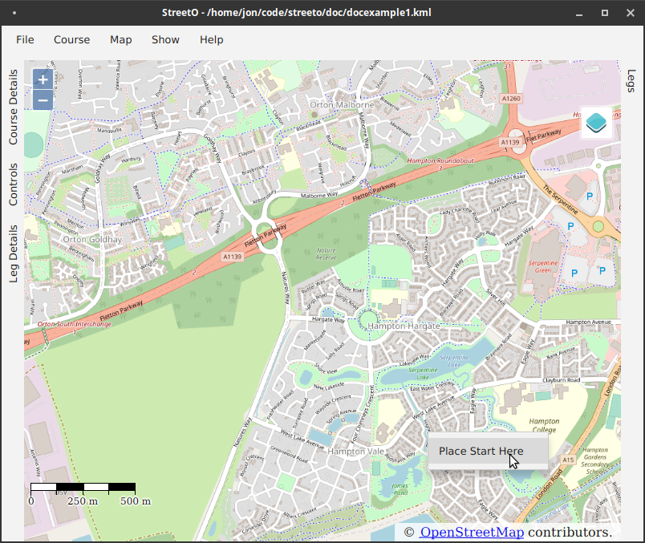
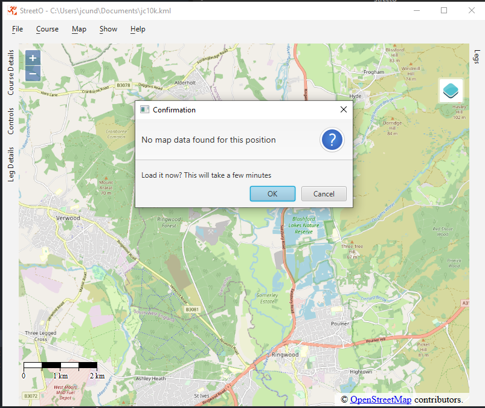
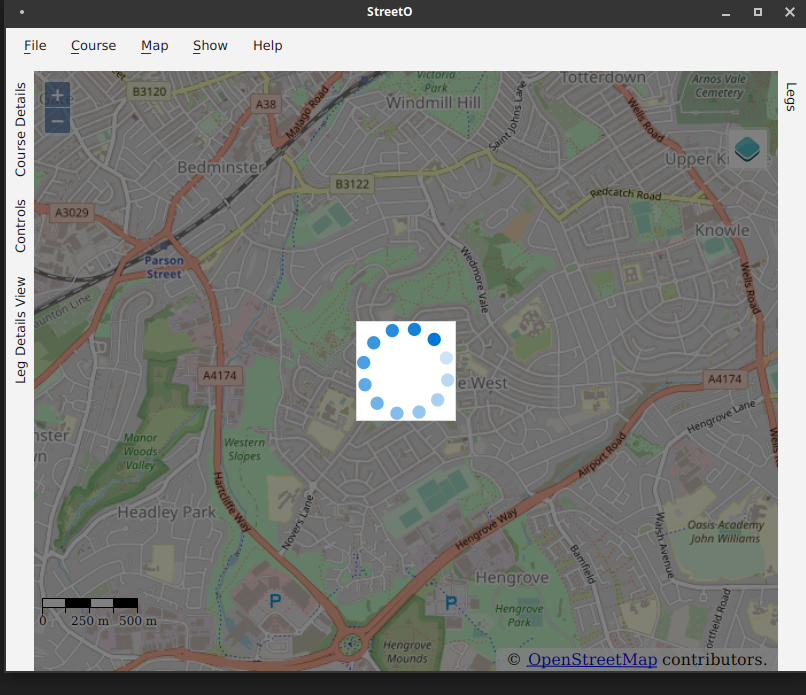
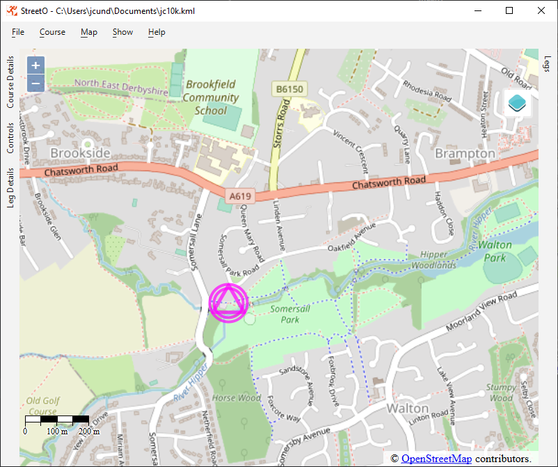
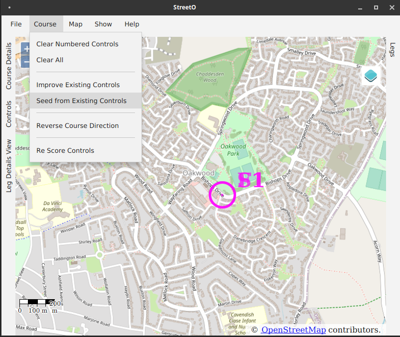
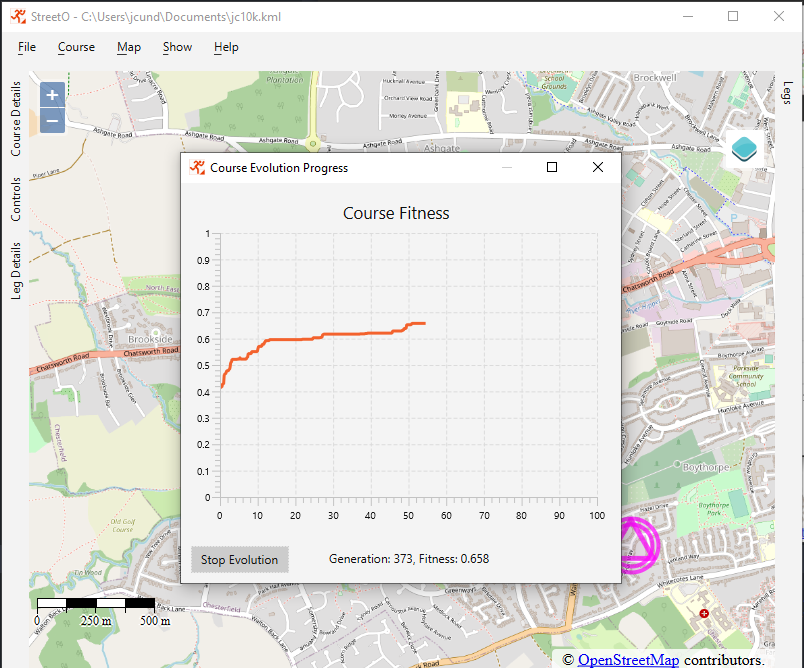
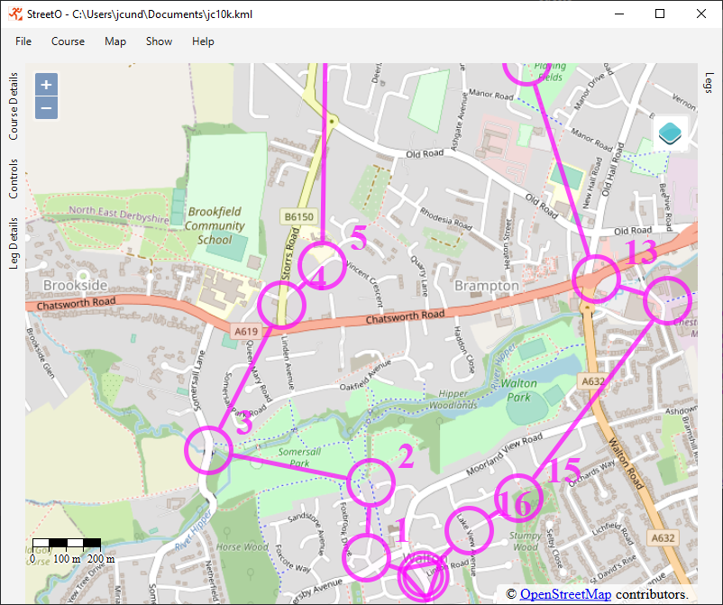
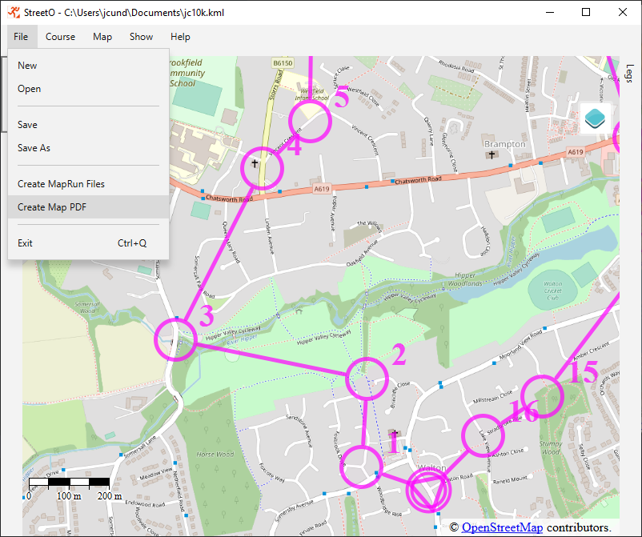

[back](./UserGuide.md)

## Getting Started

### Generating your first Course

StreetO's main window shows an OpenStreetMap map.

The map is centered on the last location you used. If you have never used the software before, it will be centered on
Boston in the US.

Navigate around the map as you would with Google Maps or OpenStreetMap.

Zoom in and out with the mouse wheel. Pan with the left mouse button. Holding Shift while panning rotates the map.

You can right-click on the map to add a new course.

If this is the first time you are using StreetO to create a course in this area then OSM Map Data for this area will
need to be imported into the system first.

This is handled automatically.

Data for the smallest area including this location is downloaded via
the [Geofabrik](https://download.geofabrik.de/index.html) api. This is a free service that provides OpenStreetMap data
for the whole of the world.

Once the data has been downloaded it will be imported into the routing engine, processed and saved.

Factors such as the size of the data extract, the speed of the computer and the speed of the internet connection,
determine the time it takes to import the data. It usually takes a couple of minutes to import the data.

You must wait for the data to be imported before you can use StreetO to create a course in this area.

A Spinning Wheel is displayed while the data is being imported.

After the data has been imported you can start creating a course.

The location selected earlier for the start will now be shown on the map

Initially, the Start and the Finish are set at the same location. You can move either, or both, of them to different
locations on the map should you want to, see [Placing Controls](./PlacingControls.md) for more information.

Now that you have told the system where the start and finish are, it has enough information to generate an orienteering
course

To create a new course, go to the Course Menu and select 'Seed From Existing Controls'. We are going to use the given
Start location as a seed for this course. Seeding means that StreetO will automatically add an appropriate number of
additional controls to the course for you.

The alternative, 'Improve Existing Controls' will just use the controls that are already on the map.

As we don't have any numbered controls at all yet, we are going to use the 'Seed From Existing Controls' option.

The System will prompt you to enter the approximate distance you would like the route around this course to be.

Note, this is the distance of the shortest navigable route around all the controls on the course, and not the 'crow
flies' distance between the control sites as commonly used on orienteering maps.

Enter, for example, '6500' for a 6.5K run and click 'OK'.

StreetO will now generate the course based on the distance preference you entered, the start and finish locations, and
by default, although you can change this - see [Settings and Preferences](./SettingsAndPreferences.md#desired-average-leg-length) - try and make
the mean length of all the legs on the course around 500 m.

StreetO works by continuously generating and improving a population of candidate courses. It uses various heuristics to
decide how good each of the candidates are and then tries to 'evolve' the good ones in the population into better ones.

It takes a second or two to put together the initial population of candidate courses, after that the improvement
algorithm starts running.

Details of the progress of course population improvement process are displayed whilst it is doing this.

By default, although this is also configurable, the algorithm will run for 180 seconds.

You can manually stop the algorithm at any time by clicking the 'Stop Evolution' button.

When it has finished, it will take the best course it made from the evolved population and display that on the map.

You can inspect the details of the course and its legs, see [Viewing Course Details](./ViewCourseDetails.md) for more information,
and you can manually edit the course StreetO generated for you, see [Placing Controls](./PlacingControls.md) for more
information about this.

You can also feed this course back into the algorithm to improve it further.

But for now, you probably have a decent enough course to run round.

For this you will need to print out a map to take with you, and optionally upload the relevant data to the MapRun site
if you want the map to work in conjunction with the MapRunG or MapRun6 software.

This can be done from the options on the File menu.

Both 'Create Map PDF' and 'Create MapRun Files' open a dialog box allowing you to select where to save these artifacts
to.

See this [Example PDF File](./doc/streeto.pdf) for the sort of map you'll end up with. This comes from [Open Orienteering
Map](https://oomap.co.uk). Various Options to control the size, scale and appearance of the map are available, 
see [Settings and Preferences](./SettingsAndPreferences.md#mapping-preferences) for more information.

You can just use the map to run around the course, or you can use the MapRunG or MapRun6 software, in conjunction 
with the map to get feedback when you make it to the next control.

MapRunG and MapRun6 are free software, and can be installed on your phone or Garmin watch. 
See [the MapRun site](https://maprunners.weebly.com/) for details of this software.

Using MapRunG or MapRun6 is optional, but it is recommended.

To use MapRun, you'll want to create a "Check Sites" type of course.
The [Check Sites](https://console.maprun.net/#/check_sites_create) functionality of MapRun allows you to upload the
relevant files you just created as a private and confidential 'event' and immediately download them to your phone and your watch.

See the documentation referred to above for details of how to do this.

You are now all set. Hopefully you have a decent run ahead of you, so print off the map, lace up your trainers and give
it a go.

Be sure to read the caveats' section of the [Introduction](./Introduction.md#constraints-limitations-etc) for more information on the limitations of this software.

Note: This software is still of a pre-release quality, so there may be bugs. If you find any, please let me know.

[back](./UserGuide.md)

  