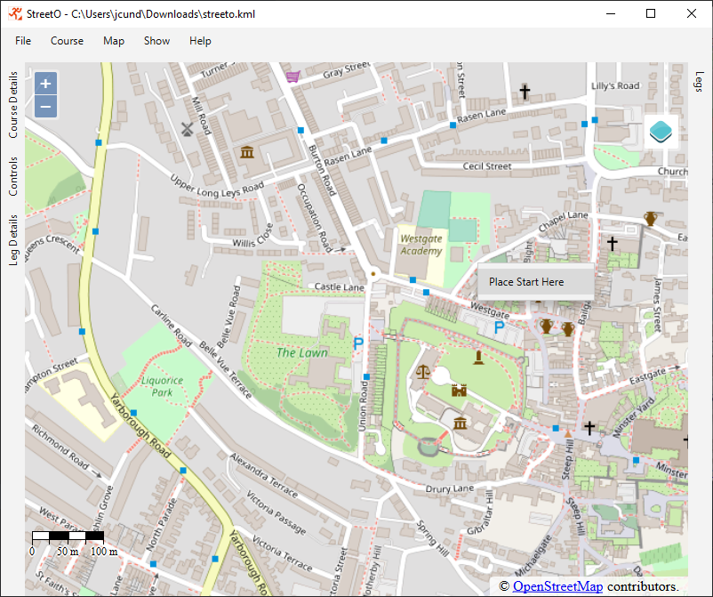

## Getting Started

### Installing

Windows and macOS Installers are available for download from [GitHub](https://github.com/jcundill/streeto/releases).

Note that currently the installers are not digitally signed, this will be fixed in the future. But for now they will trigger warning messages.

### Generating your first Course

StreetO's main window shows an OpenStreetMap map. 

The map is centered on the last location you used. If you have never used the software before, it will be centered on Boston in the US.

Navigate around the map as you would with Google Maps or OpenStreetMap.

Zoom in and out with the mouse wheel.
Pan with the left mouse button.

You can right-click on the map to add a new course.

If this is the first time you are using StreetO to create a course in this area then 
OSM Map Data for this area will need to be imported into the system first.

This is handled automatically.

Data for the smallest area including this location is downloaded via the [Geofabrik](https://download.geofabrik.de/index.html) api.
This is a free service that provides OpenStreetMap data for the whole of the world.

Once the data has been downloaded it will be imported into the routing engine, processed and saved.

Factors such as the size of the data extract, the speed of the computer and the speed on the internet connection, 
determine the time it takes to import the data. It usually takes a couple of minutes to import the data.

You must wait for the data to be imported before you can use StreetO to create a course in this area.

A Spinning Wheel is displayed while the data is being imported.

After the data has been imported you can start creating a course.

The location selected earlier for the start will now be shown on the map

[Example PDF File](./doc/streeto.pdf)

  