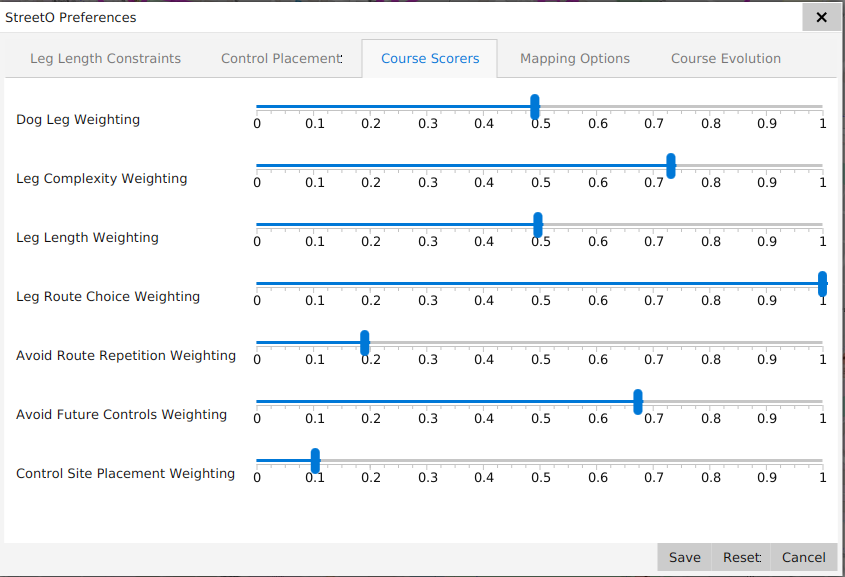

[back](./index.md)

## Heuristics

StreetO works by using a Genetic Algorithm to evolve a population of candidate orienteering courses such that the
legs on those courses would make for an interesting orienteering challenge as much as possible.

It does this by scoring each candidate course against a set of heuristics. It then retains the best scoring candidates
and feeds them into the next generation of the algorithm

You assign weightings to each of these heuristics in the
[Settings And Preferences](./SettingsAndPreferences.md#course-scoring-preferences) dialog to tell the algorithm how
much importance you want to give to each of these factors.

There is no right or wrong way to weight the heuristics. To some extent it depends on the map data at the location 
you're generating a course for, and to some extent it depends on your personal preference.

Route Choice is probably the most important heuristic in an urban orienteering course. But you can't just switch
everything else off, or you'll end up with a course that that just oscillates between two or three different locations
that have great route choice options between them, but basically just runs the same legs over and over again as you said you 
didn't care about route repetition, or exposing future controls.

So, the weightings need tweaking. Currently, they are all set to 1 by default.

What I find works well for me in my local area is something like this:

The heuristics assign a value between o and 1 for the various aspects of that leg. The score assigned to a candidate
course is derived from the mean of the weighted sum of all the heuristics on all the legs on that course. It's actually
taken as an [RMS](https://en.wikipedia.org/wiki/Root_mean_square) error value.

The heuristics that the system uses are described below.

### Dog Leg Scorer
In orienteering, a dog leg is where the route that takes to a control site is the same as the route that you take when
leaving that control site on you way to the next one.

This is generally ok, as long as the route repetition is not too long and doesn't form a significant part of the route to
the next control site.

This heuristic works out the length of the dog leg section and scores it based on that length divided by the length
of the next leg

### Leg Complexity Scorer
Leg complexity is determined by the density of navigational decisions in the leg.

As StreetO is only routing around roads, paths and tracks, the navigational decisions are around choosing the correct
path to take when there is a choice. Do I take the left here, carry on straight, or take the right?

It works by counting the turn instructions the routing engine has produced for the leg, working out their density from
the length of that leg, and comparing that density to a minimum threshold. 

The minimum threshold can be changed in the
[Settings and Preferences](./SettingsAndPreferences.md#min-average-distance-between-junctions) page.

Anything above the threshold is scored as a leg complexity of 1, anything below is scored as a fraction of how far 
outside the threshold it is.

### Leg Length Scorer
This heuristic is only concerned with the length of the shortest route between the control at the start of the leg
and the control at the end of the leg.

There are a number of [Settings and Preferences](./SettingsAndPreferences.md#leg-length-preferences) that feed into the
score given to this leg.

Legs can have a minimum and maximum acceptable length. The first and the last legs can have different acceptable 
maximum lengths.

This heuristic will assign a score of 1 if the leg length is within the acceptable range and a fraction based on how 
far outside the range it is if it doesn't fall within the acceptable values.

### Leg Route Choice Scorer
This heuristic is based on the number of possible alternative routes that the routing engine has produced for the leg.

Ir there are no alternative routes, the leg is scored as 0.

If there are alternative routes, the leg is scored based on how similar in length the best two alternative routes are.

It is scored as a ratio of the length of the best alternative route to the length of the next best alternative route. 
The ratio of the route length that these legs have in common is subtracted from the result.

So two alternative routes that are nearly the same length will score very well, but if most of the time they follow 
the same path, and maybe just deviate towards the end of the leg, then this will bring the score down again.

### Avoid Route Repetition Scorer
This heuristic looks at how much of the route between the control at the start of the leg and the control at the end of
this leg has already been followed on the routes between the previous controls on the course.

If this is the first leg, there can be no repetition, so the score is 1.

Otherwise, it compares the most probable route on each of the previous legs with the most probable route on this leg,
takes the longest common route length from any of those previous legs and scores this leg as the fraction of that 
longest common route length divided by the length of this leg.

### Avoid Future Controls Scorer
This heuristic scores a leg badly if any of the probable alternative routes from the start control to the end control 
of this leg will take you to, or close to, a control that is coming up later in the course.

It factors the score by the likelihood that you might choose that alternative route. This decision is based on how 
similar in length to the shortest possible route this alternative is.

The acceptable minimum distance any point on the route can be from a future control can be specified in the
[Settings and Preferences](./SettingsAndPreferences.md#min-control-separation).

### Control Site Placement Scorer

This heuristic scores a leg based only on what kind of 'feature' the control at the end of the leg is placed on.
Controls will always be placed on street furniture is there is any in the immediate vicinity of that control.

This is done as things like bus stops or post boxes are obvious markers of the location of the control on the ground, 
and make for obvious targets whilst navigating the course.

The radius around a control where the algorithm will look for street furniture to snap that control to 
is specified in the [Settings and Preferences](./SettingsAndPreferences.md#street-furniture-distance).

If there is no street furniture in the vicinity of the control, then the control is snapped to the nearest junction or 
bend in the path to that location.

There are  [Settings and Preferences](./SettingsAndPreferences.md#control-placement-preferences) that 
allow you to define what is considered a sharp enough bend to constitute a valid control site.

You can allocate fractional scores to these non-street furniture controls locations, if you want to encourage the 
algorithm not to use them.

This heuristic simply scores the leg based on the score given to feature type of the control at the end of the leg.

You may not care about this heuristic, and so can give it a low weighting, but there are a lot more junctions than there
are bus stops, benches and post boxes on the map, so if you ignore this heuristic completely you generally end up with
a course that just goes from road junction to road junction all the time. Making use of available street furniture
generally makes for a more enjoyable run.

[back](./index.md)