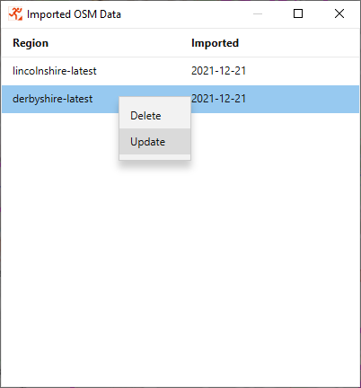

[back](./UserGuide.md)

## Managing Open Street Map Data

StreetO works by loading Open Street Map data into the [GraphHopper](https://wiki.openstreetmap.org/wiki/GraphHopper) 
routing engine, and then using a Genetic Algorithm on top of that routing engine to try and evolve a set of leg routes
that would make an interesting orienteering course.

To do this, Open Street Map data for the location containing the course must first be imported into the system.

### Importing Open Street Map Data

Open Street Map data is automatically loaded into the system when you choose to generate a course in an area that
the system doesn't already have data for.

You are prompted to this effect when you try and add a start location to an empty map.

Data for the smallest area including this location is downloaded via
the [Geofabrik API](https://download.geofabrik.de/index.html). This is a free service that provides OpenStreetMap data
for the whole of the world.

Once the data has been downloaded it will be imported into the routing engine, processed and saved.

Factors such as the size of the data extract, the speed of the computer and the speed of the internet connection,
determine the time it takes to import the data. It usually takes a couple of minutes to import the data.

You must wait for the data to be imported before you can use StreetO to create a course in this area.

Information regarding the 'Street Furniture' - bus stops, post boxes, etc. is also downloaded via the 
[Overpass API](https://wiki.openstreetmap.org/wiki/Overpass_API) for the area immediately surrounding the start
location at the same time.

### Managing Imported Open Street Map Data

From the Show Menu, select 'Imported Data' to see which data extracts have already been downloaded into the system.

Right-clicking on one of the data extracts will bring up a menu of options. 
From here you can delete the data extract from the system, or re-import it again to get the latest data.

[back](./UserGuide.md)