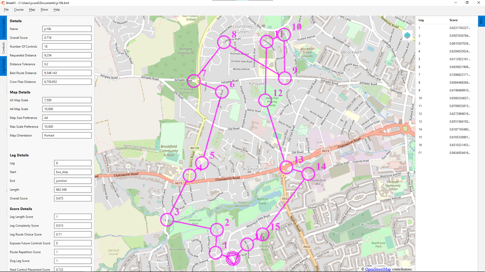
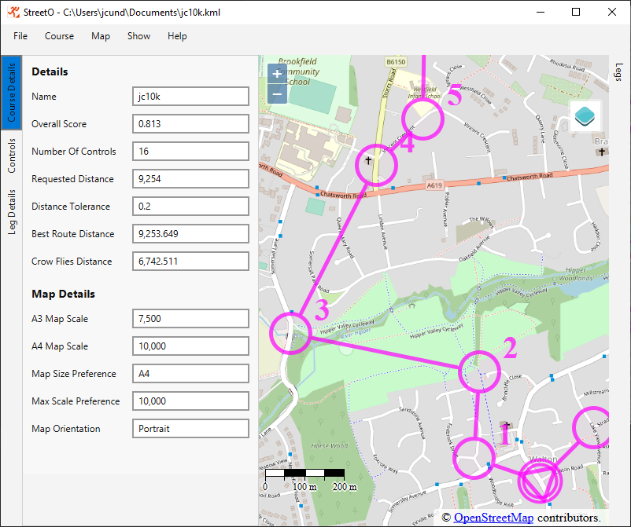
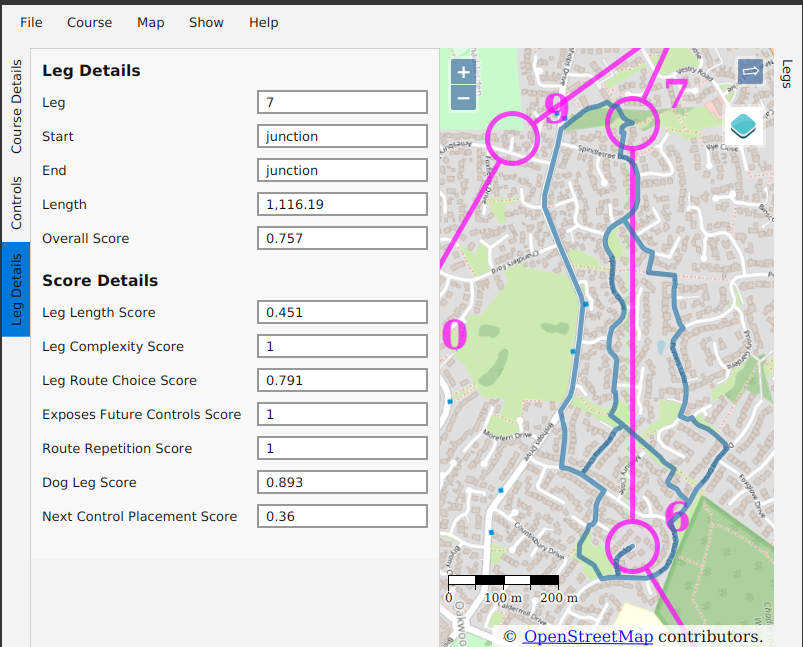

[back](./index.md)

## Introduction to the StreetO User Interface

The primary view shown in StreetO is a map.
You can add control sites onto this map and link them together to form an orienteering course.
Placing Controls onto the map is discussed in [Placing Controls](./PlacingControls.md).

StreetO is mainly concerned with the generation and evaluation of potential Orienteering Courses.
To aid with this there are a number of supplementary views displaying this evaluation information.

The supplementary views are called 'drawers' with the UI.

These can be opened from the tabs on the left and right of the map as shown below.

This screenshot shows the main view of StreetO and three of the drawers open

The details of these drawer views are described in the sections below.

You can control how they display alongside the map view by right clicking in the relevant margin.

Floating drawers are opened on top of the map view. Non-floating drawers are shown next to the map view. I.e. 
they make the area allocated to the map smaller.
Multiselect allow you to have more than one of the drawers open at the same time.

### Course Details View

The Course Details Drawer View gives overall information about the generated course.

It is divided into two sections, Details and Map Details, as shown below.

#### Details Section

##### Name 

Name is the simple filename of the file, if any, that this course was initially loaded from. The full path
to this file is shown in the window tille.

##### Overall Score

How good StreetO thinks the course is. Scores are decimal values between 0 and 1. 1 is a prefect score.

##### Number Of Controls

How many numbered controls (in addition to the start and the finish) are there on this course.

##### Requested Distance

How long was the algorithm told the shortest route around the course should be. This can be either manually
entered or based on the length of an existing course, see [Generating Courses](./GeneratingCourses.md) for the details of this.

##### Distance Tolerance

Distance tolerance displays the [Settings and Preferences](./SettingsAndPreferences.md) distance tolerance value currently set up. This constrains 
how much shorter or longer than the requested distance an acceptable course can be.

##### Best Route Distance

What StreetO thinks is the shortest possible route around the course. In the example shown above we tried to 
improve the control site locations of an already well scoring course, and made little difference to the result.

##### Crow Flies Distance

The sum of the straight line distances of all the legs on the course.

#### Map Details Section

##### A3 Map Scale
The Map scale you'd end up with if this course was printed onto A3 paper.

##### A4 Map Scale
The Map scale you'd end up with if this course was printed onto A4 paper.

##### Map Size Preference
Whuch option is selected in [Settings and Preferences](./SettingsAndPreferences.md) for Map paper size.

##### Max Scale Preference
The value from  [Settings and Preferences](./SettingsAndPreferences.md) for the highest scale the system should
allow maps to be printed at.

##### Map Orientation
Whether the map for this course has Landscape or Portrait orientation.

### Controls View

The Controls Drawer contains a list showing what type of feature each control on the course is placed on.

Right clicking on any of the controls brings up a menu that allows you to view further details, the coordinates of the control, or to zoom the map display into the area around this control.

### Leg Details View

The Leg Details Drawer shows the details of the leg that is currently selected.

it is divided into two sections, Leg Details and Score Details, as shown below.

#### Leg Details Section

##### Leg
The leg number of the control that the currently selected leg takes you to.

##### Start
Type of feature the start of the leg is placed on.

##### End
Type of feature the end of the leg is placed on.

##### Length
The length of the leg in metres.

##### Overall Score
How good StreetO thinks the leg is. Scores are decimal values between 0 and 1. 1 is a prefect score.

#### Score Details Section

The score details section shows the individual scores for the various features of the leg.

##### Leg Length Score
How well this leg is scored based on its length. In the example above, the leg is scored quite low because it is longer 
than the max individual leg length set in [Settings and Preferences](./SettingsAndPreferences.md).

##### Leg Complexity Score
How well this leg is scored based on its navigational complexity. 

##### Leg Route Choice Score
How well this leg is scored based on its potential route choices.

##### Exposes Future Controls Score
Score for how much running this leg will take you too close to future controls on the course.

##### Route Repetition Score
Score based on how much the route of this leg follows a path/track/road that has been used before on earlier legs.

##### Dog Leg Score
Score based on how much of this leg is a dog leg route from the previous leg. In the example above,
there is a little bit of a dog leg getting to, and moving on from, control 6.

##### Next Control Placement Score
How StreetO thinks this leg is scored based on the next control placement. How well the various features
on a map are scored is controlled by  [Settings and Preferences](./SettingsAndPreferences.md). 

### Legs View
The Legs View Drawer on the right had side margin displays a list of all the legs on the course and 
the overall score StreetO assigned to that leg.

Clicking on a leg in the list will select it as the current leg. This will update the information in 
the Leg Details View.

Legs can be selected in the list by either clicking on them or using the up and down arrows on the keyboard.

Selecting a leg does not automatically zoom the map display in to focus on that leg, but this option is
available from a right click context menu.

Options exist 

[back](./index.md)