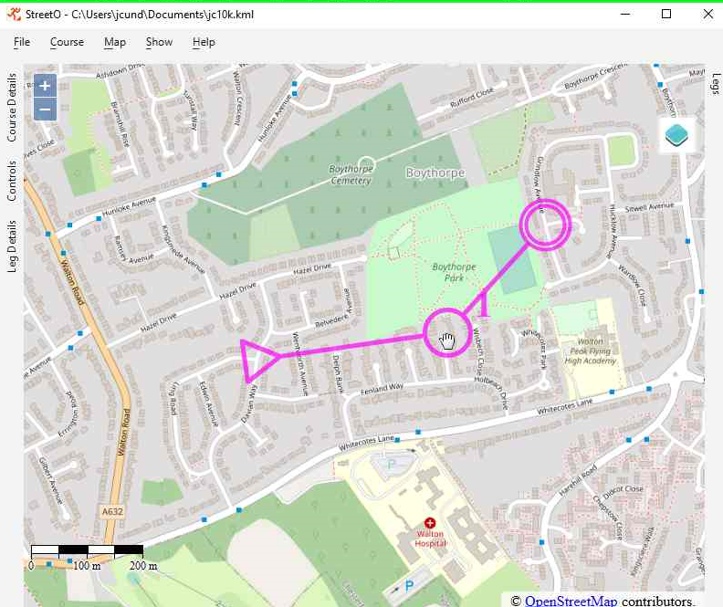

[back](./index.md)

## Placing and Editing Controls on the Map

Controls can only be placed on to 'features' on the map.

A feature is one of the following:

- Street Furniture, such as a tree, a bench, a bus stop, etc.
- A path, track or road junction.
- A bend in a path, track or road.

The [Settings abd Preferences](./SettingsAndPreferences.md#control-placement-preferences) describes how to tweak what constitutes an acceptable
feature. Only accept a bend if it's something like a right angle, only consider street furniture less than 15 metres
away from the click location, etc.

Controls will snap to the nearest feature when placed or moved.

Controls can be added to the map either by loading an existing course
file [Loading and Saving Courses](./LoadingSavingCourses.md) or by adding them manually

Right-clicking on any part of the map outside the circle of any existing control will display the Start and Finish
context menu.

If there are no existing Start and Finish controls on the map they will be added at location of the mouse click.

If they already exist then the selected option, the Start or the Finish, will be moved from its current position to the
location of the mouse click.

This can be done at any time, even if there are additional controls on the map.

Right-clicking within the control circle of a control will display the Edit context menu for that control.

### Details

This pops up a dialog box with the details of the control. The type of feature it is on and it Lat and Lon coordinates.

### Split Leg After

This will add an extra control in between this one and the next control on the map. The added control is placed on an
available feature from the map roughly halfway along the existing leg.

### Split Leg Before

This will do the same as the above, but place the additional control on the leg leading up to this control.

### Remove Control

Removes the selected control from the map, the leg for control before this one now goes to the control after this one.

## Moving Controls

An existing control can be moved by clicking within the control circle to select that control and then holding the left
mouse button down and dragging the control to a new location.

Once the control has been selected by clicking on it, the cursor will change to a hand. This means that the control can
be moved by dragging it.

Mouse down and dragging when the cursor is still showing the arrow cursor will pan the map, rather than move the
control.

[back](./index.md)