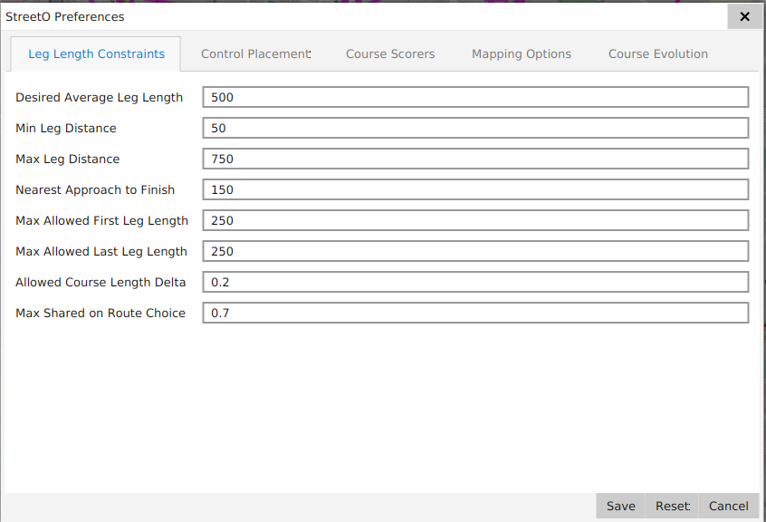
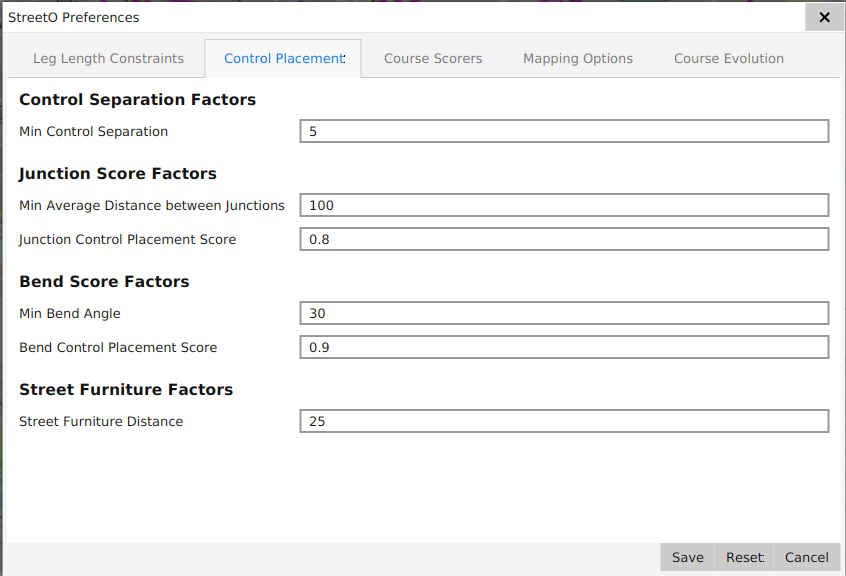
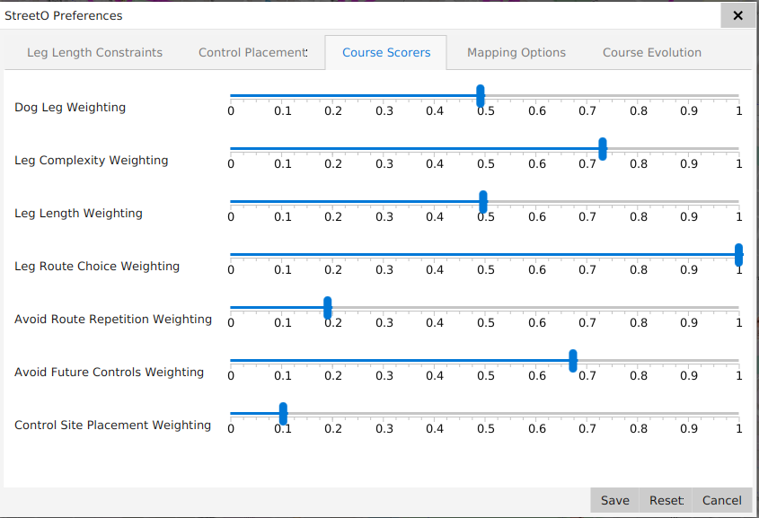
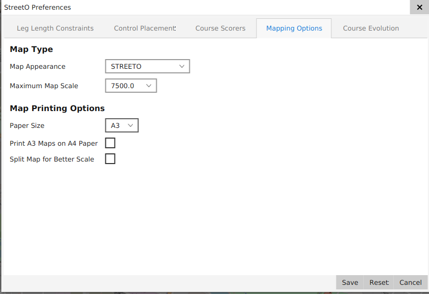
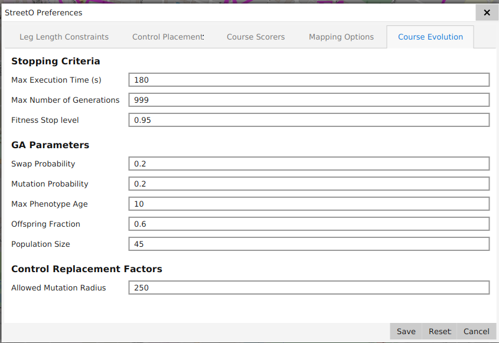

[back](./index.md)

## Settings and Preferences

### Leg Length Preferences
These influence placement of controls by the algorithm and are used to determine what would be considered 
a good length for any given leg of a potential course.

#### Desired Average Leg Length

#### Min Leg Distance

#### Max Leg Distance

#### Nearest Approach to Finish

#### Max Allowed First Leg Length

#### Max Allowed Last Leg Length

#### Allowed Course Length Delta

### Control Placement Preferences
These influence what the algorithm considers to be a good control site based on the feature on the
map at that location and how close the control is to other controls on the course.

StreetO will select potential control sites based on the following criteria:
- There is street furniture, a bus stop for example, at that location
- There is a road or path junction at that location
- There is a obvious bend in the road or path at that location

Street Furniture is always selected if there is any at that location. If not, the algorithm will consider the
other features but score the leg to that control site lower.

#### Min Control Separation
This is the minimum straight line distance in metres between this and any other control on the course that would
make the location in question a valid potential control site.

#### Junction Score Factors
These determine how much the algorithm considers a junction feature at the current location to be a potential control site.

##### Min Average Distance between Junctions

[back](./index.md)