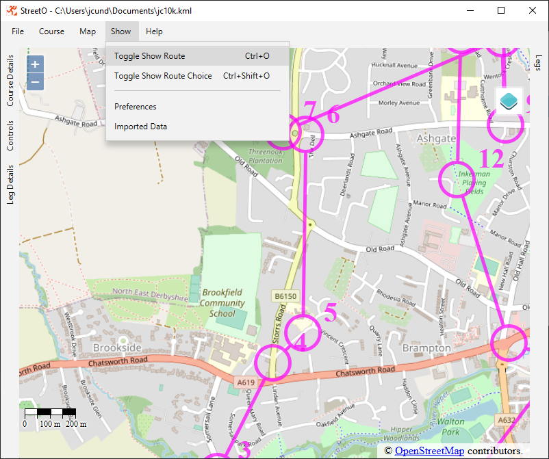
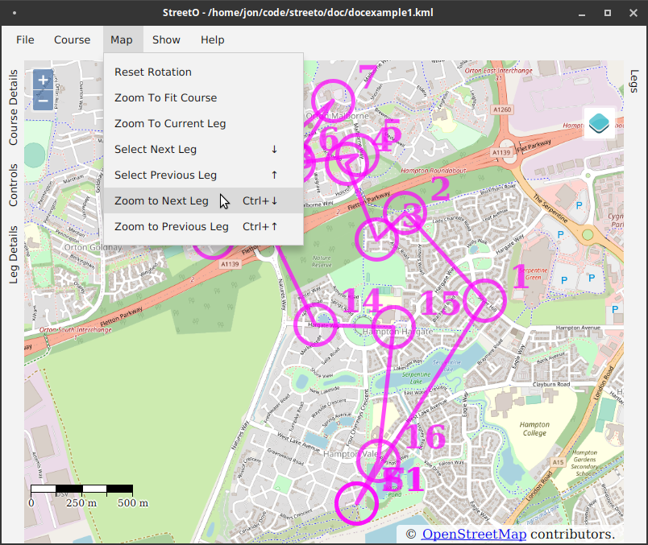

[back](./index.md)

## Viewing Course Details

### Showing Routing Overlays

What the algorithm considers to be the best route around can be overlaid on the map. Similarly, what the 
algorithm thinks the route choice options on the currently selected leg are can also be overlaid on the map.

Both of these options are available from the Show menu.

They act as toggles, and the relevant overlay can be toggled on and off.

### Focussing the Map on the different sections of the course

The Map menu contains a number of options for controlling what parts of the course are displayed on the map.

What we are most interested in here is zooming into and inspecting the individual legs that make up the course.

These menu options are discussed in more detail below.

#### Reset Rotation
Legs, when zoomed into, are always displayed as though they were going from south to north. This is done by
rotating the map. This option resets the rotation to 0, so that actual north is at the top again.

#### Zoom to Fit Course
Set the map resolution to fit the course in its entirety, regardless of the current map rotation.

#### Zoom to Current Leg
Set the map resolution to fit the current leg in its entirety, the map is rotated so that the leg appears 
to go from south to north on the map.

The current leg is the leg that is currently selected in the legs view, or the leg from the control selected 
by clicking on it on the map.

#### Select Next Leg
Select the next leg in the course, but do not change the current map resolution or rotation. This is useful if you want to walk
through the legs of a course with the route choice overlay toggled on whilst viewing the entire course, for example.

#### Select Previous Leg
As above, but selects the previous leg in the course.

#### Zoom to Next Leg
This is similar to the Select Next Leg option, but it also changes the map resolution and rotation to fit the next leg in the course.

#### Zoom to Previous Leg
As above, but selects the previous leg in the course.

[back](./index.md)